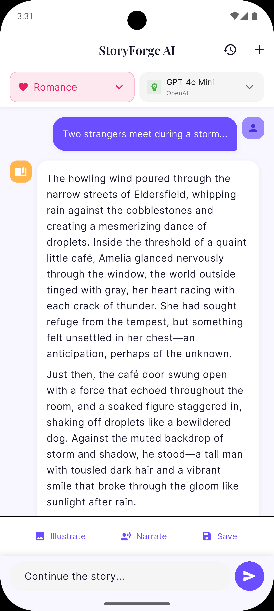
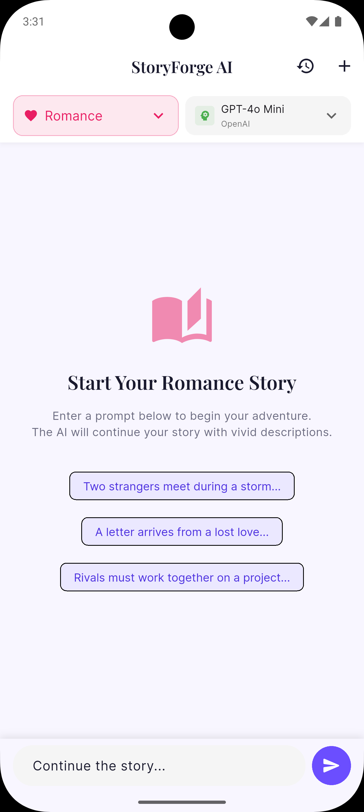
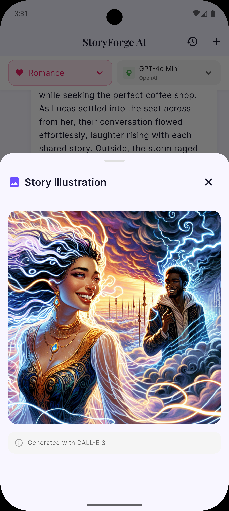
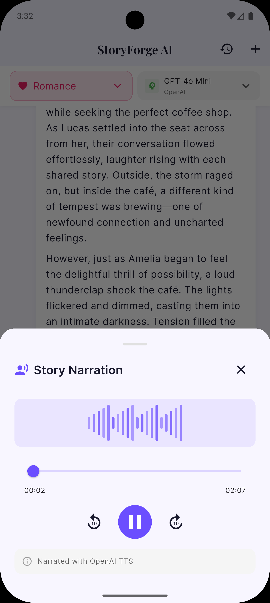
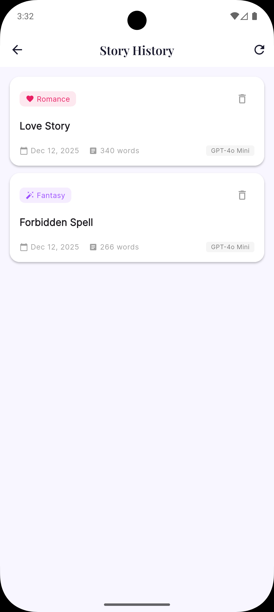

# StoryForge AI 📖✨

> **Multi-modal AI Story Creator** - Create interactive stories with AI-powered text generation, DALL-E illustrations, and voice narration.

[](https://flutter.dev)
[](https://www.python.org)
[](https://flask.palletsprojects.com)
[](https://bloclibrary.dev)
[](https://blog.cleancoder.com/uncle-bob/2012/08/13/the-clean-architecture.html)

A full-stack mobile application demonstrating advanced LLM engineering concepts including multi-model support, tool calling, and multi-modal AI generation. Built with **Clean Architecture** principles for maintainability and testability.

---

## 📋 Table of Contents

- [Features](#-features)
- [Clean Architecture](#-clean-architecture)
- [Tech Stack](#-tech-stack)
- [Project Structure](#-project-structure)
- [Getting Started](#-getting-started)
- [API Documentation](#-api-documentation)
- [Week 2 Concepts](#-week-2-concepts)
- [Future Enhancements](#-future-enhancements)

---

## ✨ Features

### Core Functionality
- **📝 Interactive Story Generation**: Chat-style interface for creating stories with AI
- **🎨 DALL-E Illustrations**: Generate visual art for story scenes
- **🔊 Voice Narration**: Text-to-speech with multiple voice options
- **🤖 Multiple AI Models**: Switch between GPT-4, Gemini, and Claude
- **🛠️ Tool Calling**: AI-powered character naming and plot suggestions
- **💾 Story Persistence**: Save and revisit your stories

### User Experience
- **🎭 Genre Selection**: Fantasy, Sci-Fi, Mystery, Romance, Horror, Adventure
- **⚡ Real-time Streaming**: Watch the story unfold character by character
- **🌙 Dark Mode**: Automatic theme switching based on system settings
- **📱 Beautiful UI**: Modern Material 3 design with storytelling aesthetic

---

## 📸 UI Screenshots

<p align="center">
  
  
</p>
<p align="center">
  
  
  
</p>

---

## 🏛️ Clean Architecture

This project follows **Clean Architecture** principles, separating the codebase into distinct layers with clear boundaries and dependencies.

### Architecture Diagram

```
┌─────────────────────────────────────────────────────────────────────┐
│                        PRESENTATION LAYER                           │
│   ┌─────────────┐   ┌─────────────┐   ┌─────────────────────────┐  │
│   │   Screens   │   │   Widgets   │   │          BLoC           │  │
│   │             │◄──│             │◄──│  (Events → Use Cases)   │  │
│   │ StoryScreen │   │ MessageBubble│  │                         │  │
│   │HistoryScreen│   │ GenreSelector│  │ StoryBloc               │  │
│   └─────────────┘   └─────────────┘   └───────────┬─────────────┘  │
│                                                    │                │
└────────────────────────────────────────────────────┼────────────────┘
                                                     │ Uses
┌────────────────────────────────────────────────────▼────────────────┐
│                         DOMAIN LAYER                                │
│   ┌─────────────────┐   ┌─────────────────────────────────────┐    │
│   │    Entities     │   │            Use Cases                │    │
│   │                 │   │                                     │    │
│   │ • Story         │   │ • GetAvailableModels                │    │
│   │ • ChatMessage   │   │ • GenerateStory / StreamStory       │    │
│   │ • AIModel       │   │ • IllustrateScene                   │    │
│   │ • GenerationRes │   │ • NarrateText                       │    │
│   └─────────────────┘   │ • SaveStory / GetStory / DeleteStory│    │
│                         │ • GetStoryHistory                   │    │
│   ┌─────────────────┐   └─────────────────────────────────────┘    │
│   │   Repository    │◄─── Interface (Contract)                     │
│   │   (Interface)   │                                               │
│   └─────────────────┘                                               │
│                                                                     │
└─────────────────────────────────────────────────────────────────────┘
                              │ Implements
┌─────────────────────────────▼───────────────────────────────────────┐
│                          DATA LAYER                                 │
│   ┌─────────────────────────────────────────────────────────────┐  │
│   │                  Repository Implementation                   │  │
│   │                  (StoryRepositoryImpl)                       │  │
│   │   • Converts between Models and Entities                     │  │
│   │   • Handles data source orchestration                        │  │
│   └──────────────────────────┬──────────────────────────────────┘  │
│                              │                                      │
│   ┌──────────────────────────▼──────────────────────────────────┐  │
│   │                    Data Sources                              │  │
│   │   ┌──────────────────┐   ┌──────────────────────────────┐   │  │
│   │   │  Remote (API)    │   │         Models               │   │  │
│   │   │                  │   │                              │   │  │
│   │   │  • Dio HTTP      │   │  • StoryModel                │   │  │
│   │   │  • Error handling│   │  • ChatMessageModel          │   │  │
│   │   │  • JSON parsing  │   │  • AIModelModel              │   │  │
│   │   └──────────────────┘   │  • ResponseModels            │   │  │
│   │                          └──────────────────────────────┘   │  │
│   └─────────────────────────────────────────────────────────────┘  │
│                                                                     │
└─────────────────────────────────────────────────────────────────────┘
                              │
┌─────────────────────────────▼───────────────────────────────────────┐
│                          CORE LAYER                                 │
│   ┌────────────────┐  ┌────────────────┐  ┌────────────────────┐   │
│   │   Constants    │  │     Theme      │  │  Error Handling    │   │
│   │                │  │                │  │                    │   │
│   │ • ApiConstants │  │ • AppTheme     │  │ • Exceptions       │   │
│   │ • AppConstants │  │ • Colors       │  │ • Failures         │   │
│   └────────────────┘  └────────────────┘  └────────────────────┘   │
│                                                                     │
│   ┌────────────────┐  ┌────────────────────────────────────────┐   │
│   │   Use Cases    │  │     Dependency Injection               │   │
│   │   (Base)       │  │                                        │   │
│   │                │  │  • GetIt Service Locator               │   │
│   │ • UseCase<T,P> │  │  • Singleton registration              │   │
│   │ • NoParams     │  │  • Factory registration                │   │
│   └────────────────┘  └────────────────────────────────────────┘   │
│                                                                     │
└─────────────────────────────────────────────────────────────────────┘
```

### Layer Responsibilities

| Layer | Responsibility | Dependencies |
|-------|---------------|--------------|
| **Presentation** | UI, State Management (BLoC), User Interaction | Domain Layer |
| **Domain** | Business Logic, Entities, Use Cases, Repository Interfaces | None (Pure Dart) |
| **Data** | Data Sources, Models, Repository Implementations | Domain Layer |
| **Core** | Shared utilities, Constants, Theme, DI, Error Handling | None |

### Dependency Rule

The **Dependency Rule** states that source code dependencies can only point **inward**:

- **Presentation** → **Domain** ← **Data**
- **Domain** layer knows nothing about **Presentation** or **Data**
- Business rules are completely independent of UI and database

---

## 🏗️ Tech Stack

### Frontend (Flutter)
- **Architecture**: Clean Architecture with BLoC
- **State Management**: flutter_bloc (Enterprise-level, reactive streams)
- **Dependency Injection**: GetIt (Service Locator)
- **HTTP Client**: Dio with interceptors
- **UI**: Material 3, Google Fonts, Flutter Markdown
- **Audio**: audioplayers package

### Backend (Flask)
- **Framework**: Flask 3.0 with CORS support
- **AI Integration**: LiteLLM (unified API)
- **Multi-modal**: OpenAI DALL-E 3, OpenAI TTS
- **Database**: SQLite for persistence
- **Tool Calling**: Custom story enhancement tools

---

## 📁 Project Structure

```
story_forge_ai/
├── lib/
│   ├── core/                           # Shared Core Layer
│   │   ├── constants/
│   │   │   ├── api_constants.dart      # API URLs, timeouts
│   │   │   └── app_constants.dart      # App-wide constants
│   │   ├── di/
│   │   │   └── injection_container.dart # GetIt dependency setup
│   │   ├── error/
│   │   │   ├── exceptions.dart         # Custom exceptions
│   │   │   └── failures.dart           # Failure classes
│   │   ├── theme/
│   │   │   └── app_theme.dart          # Material 3 theming
│   │   └── usecases/
│   │       └── usecase.dart            # Base use case interface
│   │
│   ├── domain/                         # Domain Layer (Pure Business Logic)
│   │   ├── entities/
│   │   │   ├── story.dart              # Story entity
│   │   │   ├── chat_message.dart       # Chat message entity
│   │   │   ├── ai_model.dart           # AI model entity
│   │   │   ├── generation_response.dart # Response entities
│   │   │   └── entities.dart           # Barrel export
│   │   ├── repositories/
│   │   │   └── story_repository.dart   # Repository interface
│   │   └── usecases/
│   │       ├── get_available_models.dart
│   │       ├── generate_story.dart
│   │       ├── stream_story.dart
│   │       ├── illustrate_scene.dart
│   │       ├── narrate_text.dart
│   │       ├── save_story.dart
│   │       ├── get_story_history.dart
│   │       ├── get_story.dart
│   │       ├── delete_story.dart
│   │       └── usecases.dart           # Barrel export
│   │
│   ├── data/                           # Data Layer
│   │   ├── datasources/
│   │   │   └── story_remote_datasource.dart # API client (Dio)
│   │   ├── models/
│   │   │   ├── story_model.dart        # with toEntity/fromEntity
│   │   │   ├── chat_message_model.dart
│   │   │   ├── ai_model_model.dart
│   │   │   ├── generation_response_models.dart
│   │   │   └── models.dart             # Barrel export
│   │   └── repositories/
│   │       └── story_repository_impl.dart # Repository implementation
│   │
│   ├── presentation/                   # Presentation Layer
│   │   ├── blocs/
│   │   │   └── story/
│   │   │       ├── story_bloc.dart     # BLoC with use cases
│   │   │       ├── story_event.dart    # Events
│   │   │       └── story_state.dart    # States with domain entities
│   │   ├── screens/
│   │   │   ├── story_screen.dart       # Main story UI
│   │   │   └── history_screen.dart     # Story history
│   │   └── widgets/
│   │       ├── genre_selector.dart
│   │       ├── model_selector.dart
│   │       ├── message_bubble.dart
│   │       ├── image_viewer.dart
│   │       └── audio_player_widget.dart
│   │
│   └── main.dart                       # App entry point with DI init
│
├── backend/
│   ├── app.py                          # Flask application
│   ├── services/
│   │   ├── llm_service.py              # LiteLLM integration
│   │   ├── image_service.py            # DALL-E
│   │   └── audio_service.py            # TTS
│   ├── tools/
│   │   └── story_tools.py              # Function calling tools
│   ├── database/
│   │   └── db.py                       # SQLite operations
│   └── requirements.txt
│
├── pubspec.yaml
└── README.md
```

---

## 🚀 Getting Started

### Prerequisites

- **Flutter SDK** 3.10+ ([Install Flutter](https://docs.flutter.dev/get-started/install))
- **Python** 3.10+ ([Install Python](https://www.python.org/downloads/))
- **OpenAI API Key** ([Get API Key](https://platform.openai.com/api-keys))
- Optional: Gemini API Key, Anthropic API Key

### Installation

#### 1. Clone & Navigate

```bash
cd story_forge_ai
```

#### 2. Backend Setup

```bash
cd backend

# Create virtual environment
python -m venv venv
source venv/bin/activate  # Windows: venv\Scripts\activate

# Install dependencies
pip install -r requirements.txt

# Configure environment
cp .env.example .env
# Edit .env and add your API keys:
# OPENAI_API_KEY=sk-...
# GOOGLE_API_KEY=... (optional)
# ANTHROPIC_API_KEY=... (optional)

# Start server (port 5001 to avoid macOS AirPlay conflict)
python app.py
```

Server runs at `http://localhost:5001`

#### 3. Frontend Setup

```bash
cd ..  # Back to project root

# Install Flutter dependencies
flutter pub get

# Configure API URL (if needed)
# Edit lib/core/constants/api_constants.dart
# Android emulator: http://10.0.2.2:5001
# iOS simulator: http://127.0.0.1:5001
# Physical device: http://<your-ip>:5001

# Run the app
flutter run
```

---

## 📡 API Documentation

### Base URL
- Development: `http://localhost:5001`

### Endpoints

| Method | Endpoint | Description |
|--------|----------|-------------|
| GET | `/api/models` | Get available AI models |
| POST | `/api/story/generate` | Generate story continuation |
| POST | `/api/story/generate/stream` | Stream story generation (SSE) |
| POST | `/api/story/illustrate` | Generate DALL-E illustration |
| POST | `/api/story/narrate` | Generate TTS audio |
| POST | `/api/story/save` | Save story to database |
| GET | `/api/story/history` | Get saved stories |

### Example: Generate Story

```bash
curl -X POST http://localhost:5001/api/story/generate \
  -H "Content-Type: application/json" \
  -d '{
    "prompt": "A young wizard discovers a hidden door...",
    "history": [],
    "model": "gpt-4o-mini",
    "genre": "fantasy"
  }'
```

---

## 📚 Week 2 Concepts

This project implements all Week 2 learning objectives:

| Day | Topic | Implementation |
|-----|-------|----------------|
| **Day 1** | Multiple LLM APIs | LiteLLM for unified access to GPT-4, Gemini, Claude |
| **Day 2** | Gradio/UI | Flutter chat interface (mobile equivalent) |
| **Day 3** | Chatbot | Conversation history, context management |
| **Day 4** | Tool Calling | Character name generator, plot twist suggester |
| **Day 5** | Multi-modal | DALL-E images, OpenAI TTS audio |

---

## 🔄 Differences from Week 1

This project intentionally uses different technologies to demonstrate learning:

| Aspect | Week 1 (ai_job_booster) | Week 2 (story_forge_ai) |
|--------|-------------------------|-------------------------|
| **Architecture** | Basic layered | Clean Architecture |
| **State Management** | Provider | Bloc with Use Cases |
| **Backend Framework** | FastAPI | Flask |
| **API Client** | http package | Dio |
| **Dependency Injection** | None | GetIt |
| **AI Focus** | Single model (GPT) | Multi-model (LiteLLM) |
| **Features** | CV Analysis, Cover Letter | Story Generation, Multi-modal |
| **Tool Calling** | Not used | Character names, Plot twists |
| **Multi-modal** | Not used | DALL-E images, TTS audio |

---

## 🚀 Future Enhancements

### Short-term
- [ ] Story export (PDF, EPUB)
- [ ] Image gallery for generated illustrations
- [ ] Voice selection UI
- [ ] Story sharing

### Medium-term
- [ ] Collaborative storytelling
- [ ] Custom character profiles
- [ ] Story templates
- [ ] Offline mode with local cache

### Long-term
- [ ] Fine-tuned story models
- [ ] Community story sharing
- [ ] AR story reading experience

---

## 🤝 Contributing

Contributions welcome! Areas for improvement:
- Additional AI providers
- More story genres
- Better streaming implementation
- UI/UX enhancements
- Test coverage

---

## 📄 License

Educational project - feel free to use and learn from it.

---

**Built with ❤️ using Flutter, Flask, Clean Architecture, and AI**

*Week 2 LLM Engineering Project - From single-model to multi-modal AI with Clean Architecture*
# story-forge-ai
